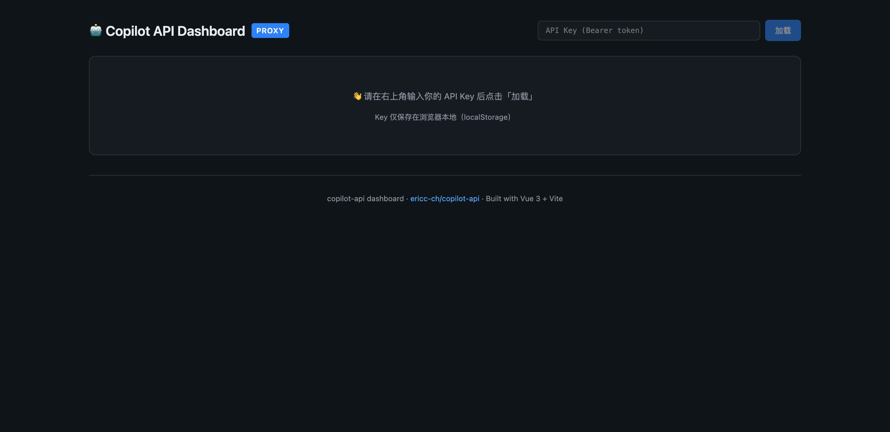
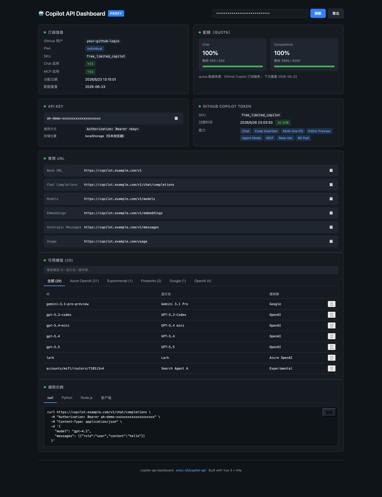

# Copilot API Dashboard

为 [`ericc-ch/copilot-api`](https://github.com/ericc-ch/copilot-api) 写的一个轻量级
Web 仪表盘，用来一站式查看你的 GitHub Copilot 订阅、配额、Token 状态、可用模型，
以及在不同语言/客户端里复制即用的调用样例。

页面使用 Vue 3 + Vite，最终产物是一份纯静态资源；后端通过一个 ~100 行的 Python
反向代理（`proxy.py`）同时承担「派发 dashboard 静态页」和「转发 OpenAI 兼容 API
请求到 copilot-api 容器」两件事。

## 预览

未登录态——只需要在右上角粘贴 API Key：



登录后——订阅信息、配额、Token 能力、常用 URL、模型列表、调用示例一屏可见：



> 截图中的 `your-github-login`、`ak-demo-...`、`tid=...`、`copilot.example.com`
> 均为脱敏后的占位值，不是任何真实数据。

## 功能

- **订阅信息**：登录名、Plan、SKU、Chat / MCP 启用状态、分配日期、配额重置日期
- **配额**：Chat 与 Completions 的剩余百分比、剩余/总额，含进度条与低额度警告色
- **API Key 卡片**：一键复制；保存在 localStorage，不上送服务器
- **Copilot Token**：解析 SKU、过期时间、剩余分钟；从 token 字符串中识别能力位
  （Chat / Code Insertion / Multi-line Fill / Editor Preview / Agent Mode /
  MCP / Rate-tier / 8K Pad / CCR）
- **常用 URL**：Base URL、`/v1/chat/completions`、`/v1/models`、`/v1/embeddings`、
  `/v1/messages`、`/usage` 一键复制
- **模型列表**：按 `owned_by` 分组过滤、关键字搜索、点击复制 model id
- **调用示例**：curl / Python (openai SDK) / Node.js (openai SDK) /
  通用客户端（Cherry Studio、NextChat、OpenWebUI 等）四种样例自动填入当前 key 与 URL

## 架构

```
Browser ──HTTPS──▶ Caddy ──▶ proxy.py (aiohttp, :4141)
                              │
                              ├── GET /dashboard/*    →  静态文件 (Vue 构建产物)
                              │
                              └── 其他路径            →  鉴权后转发到 copilot-api:4141
                                                       （并对 gpt-5/o1/o3 模型自动
                                                        把 max_tokens 改写为
                                                        max_completion_tokens）
```

`proxy.py` 关键点：

- 校验 `Authorization: Bearer <API_KEY>` 是否与环境变量一致，命中才透传，否则 401
- 透明转发请求体与流式响应（`auto_decompress=False` + `iter_any` 保持 SSE / chunked）
- 自动剥离 hop-by-hop 头（`Host`、`Content-Length`、`Connection`、
  `Transfer-Encoding`、`Content-Encoding`），避免重复或冲突
- `/dashboard/*` 走静态文件分发，并防御路径穿越（`resolve()` + `relative_to()`）

## 配置

`proxy.py` 通过环境变量配置：

| 变量 | 默认值 | 说明 |
|------|--------|------|
| `API_KEY` | `""` | dashboard 与 API 转发共用的 Bearer Token，**必须设置** |
| `UPSTREAM` | `http://copilot-api:4141` | copilot-api 上游地址 |
| `DASH_DIR` | `/app/dashboard` | dashboard 静态文件目录（应指向 `dist/`） |

## 部署

### 1. 构建前端

```bash
npm install
npm run build
# 产物输出到 dist/
```

`vite.config.js` 中 `base: '/dashboard/'` 已固定为子路径，构建产物会带上对应前缀。

### 2. 运行代理

```bash
pip install aiohttp
API_KEY="your-bearer-token" \
UPSTREAM="http://copilot-api:4141" \
DASH_DIR="$(pwd)/dist" \
python proxy.py
# 监听 0.0.0.0:4141
```

访问 `http://<host>:4141/dashboard/`，粘贴 `API_KEY` 即可使用。

### 3. Docker 化（推荐）

dashboard 与 proxy 通常和 `copilot-api` 跑在同一个 docker network 里，例如：

```yaml
services:
  copilot-api:
    image: copilot-api:patched
    networks: [copilot]

  copilot-proxy:
    build: .            # Dockerfile 把 dist/ 拷到 /app/dashboard，proxy.py 拷到 /app
    environment:
      API_KEY: "your-bearer-token"
      UPSTREAM: "http://copilot-api:4141"
      DASH_DIR: "/app/dashboard"
    ports:
      - "4141:4141"
    networks: [copilot]

networks:
  copilot:
```

外层再用 Caddy / Nginx 套一层 HTTPS 即可。

## 开发

```bash
npm install
npm run dev      # vite dev server, 默认 http://localhost:5173/dashboard/
```

dev 模式下 dashboard 自身用的 base URL 仍是 `window.location.origin`，本地联调时
建议把 vite 的 dev server 反代到一个本地的 `proxy.py`（比如 8000 端口），
或者直接 `npm run build` 后让 `proxy.py` 接管所有请求。

## 安全注意事项

- `API_KEY` 环境变量是访问整套 API 的唯一凭据，请务必使用足够长的随机串，
  并避免出现在 git 历史里
- dashboard 把用户输入的 key 存在浏览器 `localStorage`，不会发送到任何第三方
- 上游 `copilot-api` 容器自身不应暴露公网，只通过本代理出口

## 致谢

- 上游 API 实现：[ericc-ch/copilot-api](https://github.com/ericc-ch/copilot-api)
- UI：Vue 3 + Vite，零额外 UI 依赖
